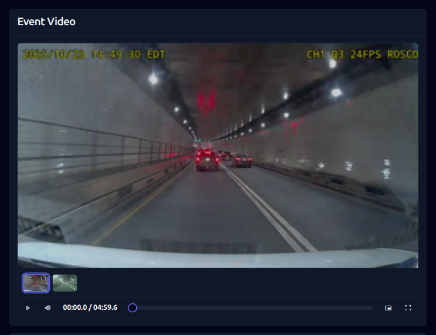
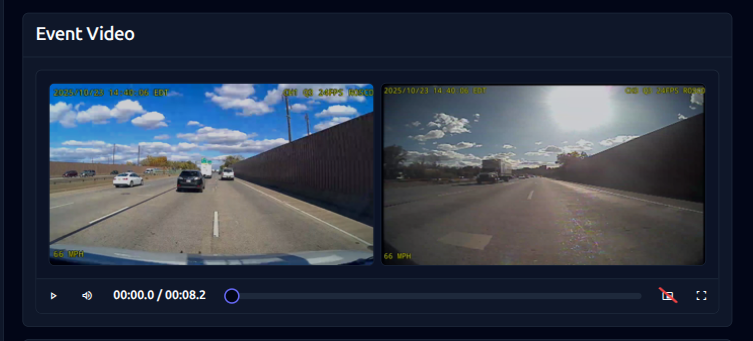
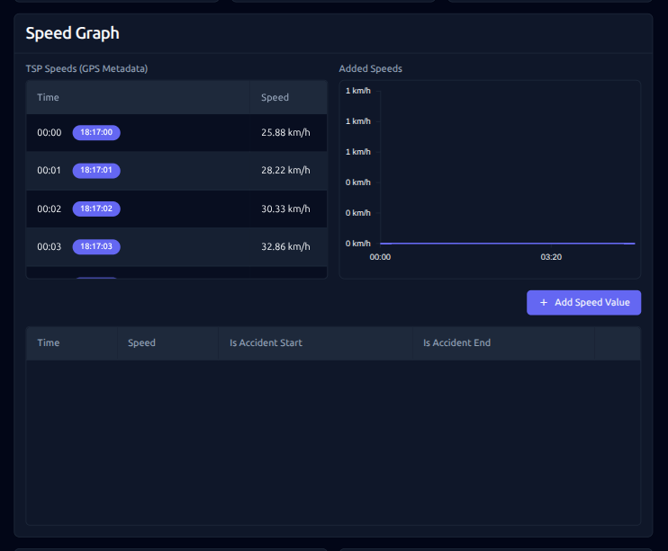
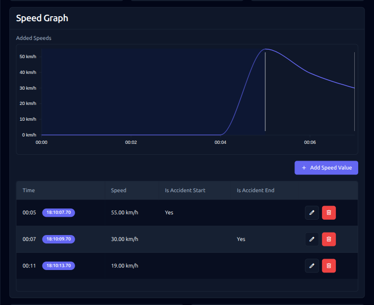
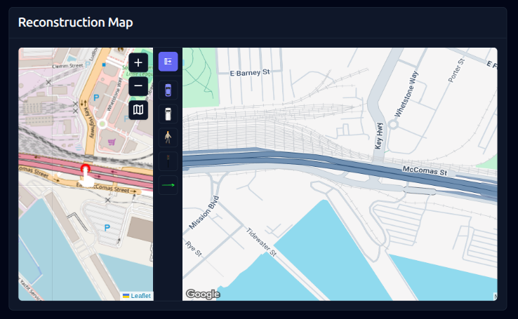
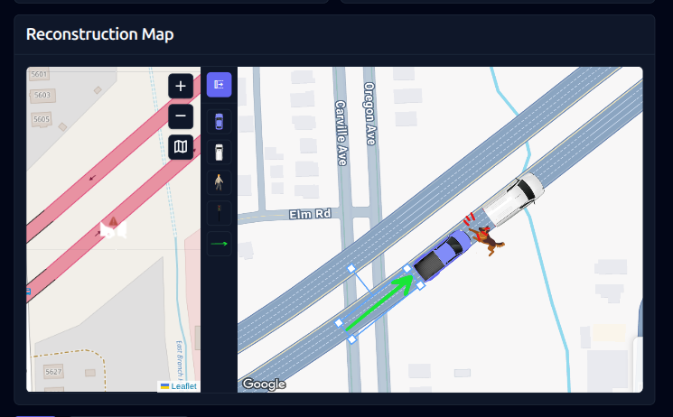

# Frontend Developer Challenge: Driving Incident Review Interface

## Overview
Build and fix an interface for reviewing driving incidents. The application shows **dashcam videos** with GPS tracking data, allowing reviewers to analyze what happened during an incident. This challenge focuses on **3 key features** that need implementation and debugging.

**Time Limit**: 45 minutes (coding) + 10-15 min (discussion)
**Difficulty**: Intermediate

## Prerequisites

- **Node.js**: v18+ or v20+ required
- **npm**: v9+ or v10+
- Vue 3 knowledge (Options API)
- HTML5 Video API familiarity
- Canvas API basics (for drawing)

## The Challenge

The user starts with a **video player input** that loads dashcam footage from multiple cameras. From the videos and GPS data (location, speed), they need to:
1. Watch the videos to understand the incident
2. Mark when the accident happened on the speed graph (accident_start, impact, accident_end)
3. Create a visual reconstruction showing where and how the accident occurred

You have **3 incomplete components** to fix and implement:

### 1. Video Player (Picture-in-Picture & Side-by-Side) (1st priority)

**What it shows:** Multiple dashcam videos from different camera angles (front, side, rear) of the driving incident. This is the **primary input** the user sees first.

**Requirements:**
- Load videos from mock API response (`event.incident.videos`)
- Two viewing modes: Picture-in-Picture and Side-by-Side
- Sync timeline across all videos when playing
- Handle videos of different lengths (use longest as timeline duration)
- Thumbnail carousel for quick camera switching

**Current Issues:**
- Videos array is empty - not loading from props
- No timeline synchronization between videos
- PiP secondary video doesn't have controls
- Mode switching doesn't work properly

### 2. Speed Graph (Chart + Table Sync) (2nd priority)

**What it shows:** Speed over time graph from GPS data. The user can **mark when the accident happened** by specifying time points as `accident_start`, `impact`, or `accident_end`. This helps identify the exact moment of the incident.

**Requirements:**
- Table to add/edit/remove speed data points
- Chart visualization that auto-updates when table changes
- Color-code accident events (accident_start, impact, accident_end) so reviewers can see critical moments
- Load initial data from GPS metadata prop (`event.incident.gpsMetadata` contains speed and timestamps)

**Current Issues:**
- Chart area shows "not implemented" placeholder
- No visualization of data points
- Adding points to table doesn't update chart
- No color coding for accident events
- GPS metadata prop not used to initialize data

### 3. Reconstruction Map (Leaflet + Canvas) (3rd priority)

**What it shows:** Visual reconstruction of **where and how the accident happened**. Based on GPS location data from `event.incident.gpsMetadata` (lat/lng coordinates), the user creates a diagram showing vehicle positions, pedestrians, and other elements at the accident scene.

**Requirements:**
- **Left side**: Leaflet map with Google Maps layer showing the GPS path and accident location
- **Right side**: Canvas drawing area for placing accident scene elements
- Sync map zoom/position with canvas background
- Toolbar to select elements (insured car, other party, pedestrian, marker)
- Click canvas to place selected element at the accident location
- Elements should be draggable and deletable

**Current Issues:**
- Leaflet map not initialized (should show location from GPS data)
- Canvas has no drawing functionality
- No zoom/position sync between map and canvas
- Element placement doesn't work
- No drag-and-drop functionality

## Getting Started

```bash
npm install
npm run dev
# Open http://localhost:5173
```

**Start by**: Opening browser console - check for errors and missing data!

## File Structure

```
src/
├── App.vue                     # Main container (loads data from API)
├── components/
│   ├── VideoPlayer.vue         # Videos with dual-mode viewing
│   ├── SpeedGraph.vue          # Chart + table for speed data
│   └── ReconstructionMap.vue   # Leaflet map + canvas drawing
public/mock-data/
├── next-event.json             # Mock event data with videos/GPS
├── video-player.png            # Reference image for video player
├── speed-graph.png             # Reference image for speed graph
└── reconstruction-map.png      # Reference image for map
```

## What to Implement

**Priority 1 - Video Player:**
- Load and display dashcam videos from API response
- Timeline sync works in at least one viewing mode
- User can watch videos to understand the incident

**Priority 2 - Speed Graph:**
- Load GPS data (speed over time) from API
- Table allows marking accident time points (accident_start, impact, accident_end)
- Chart visualization shows data points with color-coding for accident events
- Chart updates in real-time when table is edited

**Priority 3 - Reconstruction Map:**
- Leaflet map initializes with GPS location from data
- Canvas allows placing elements (cars, pedestrians) to show accident scene
- Basic map/canvas zoom sync implemented

## Reference Images

### Video Player - Picture in Picture Mode


### Video Player - Side by Side Mode


### Speed Graph - Initial State


### Speed Graph - Completed State


### Reconstruction Map - Initial State


### Reconstruction Map - Completed State

