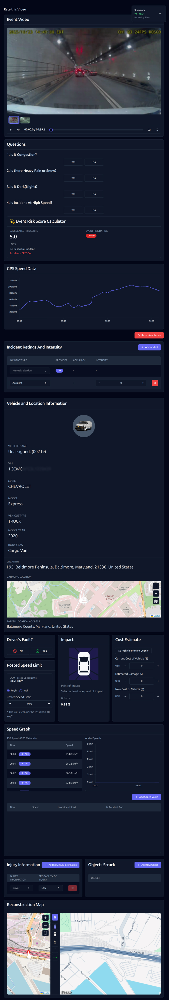

# Frontend Developer Challenge: Video Annotation Platform

## Overview
Fix bugs and complete a video annotation platform for reviewing driving incidents. Based on a real production system used to annotate thousands of events daily.

**Time Limit**: 45-50 minutes + 10-15 min discussion
**Difficulty**: Intermediate to Advanced



## Prerequisites

- **Node.js**: v18+ or v20+ required
- **npm**: v9+ or v10+
- Basic knowledge of Vue 3 (Options API & Composition API)
- Familiarity with component communication (props, emits, v-model)
- Understanding of Vue reactivity system

## The Problem

**The application is broken and incomplete!**

### Your Tasks:
1. **Investigate & Fix Issues** (30-35 min) - Get the app working and fix what's broken
2. **Identify Improvements** (10-15 min) - Find areas that need enhancement
3. **Discuss Your Approach** (10-15 min) - Explain your decisions and what you'd do next

## Getting Started

```bash
npm install
npm run dev
# Open http://localhost:5173
```

**First step**: Open browser console and start investigating!

## File Structure

11 Vue components + 1 composable + 1 utility + 2 JSON files
- `src/App.vue` - Main component orchestrating everything
- `src/components/*` - 11 feature components (VideoPlayer, QuestionsCard, RiskScoreCalculator, etc.)
- `src/composables/useTimer.js` - Countdown timer
- `src/utils/validators.js` - Validation functions
- `public/mock-data/*.json` - Mock API data

## What We're Looking For

- **Problem-solving approach**: How you investigate and diagnose issues
- **Technical knowledge**: Understanding of Vue.js patterns and best practices
- **Code quality**: Clean, maintainable fixes
- **Prioritization**: Focus on high-impact issues first
- **Communication**: Explain your thought process

## Quick Tips

- Investigate systematically - console, network, Vue DevTools
- Compare with reference image (`public/output.jpg`)
- Fix blocking issues before nice-to-haves
- Document what you find
- You can use AI tools to help debug and fix issues

## Tech Stack

Vue 3 (Options API + Composition API) • Tailwind CSS • Vite • Mock JSON APIs

---

**Focus on progress, not perfection.** This simulates inheriting real-world code with bugs and incomplete features.
